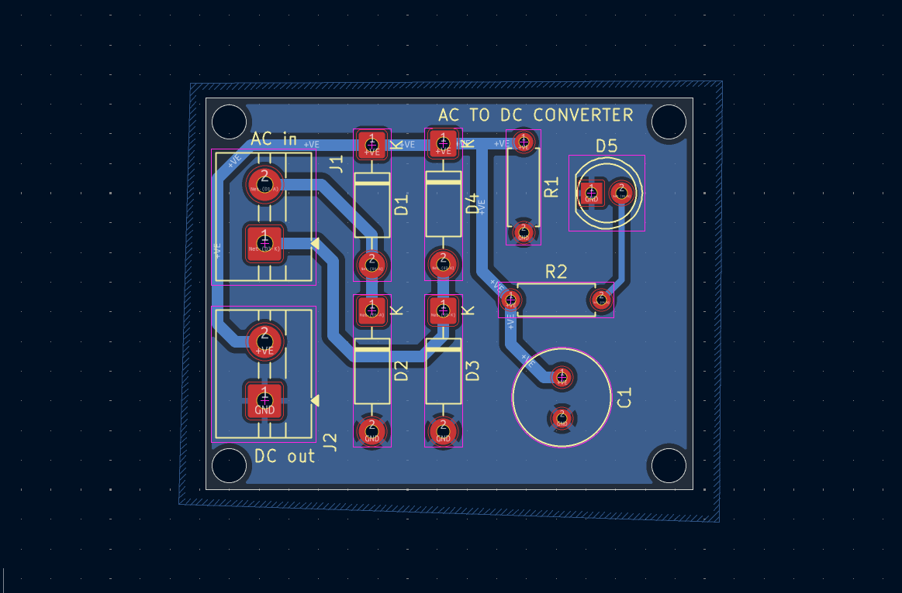
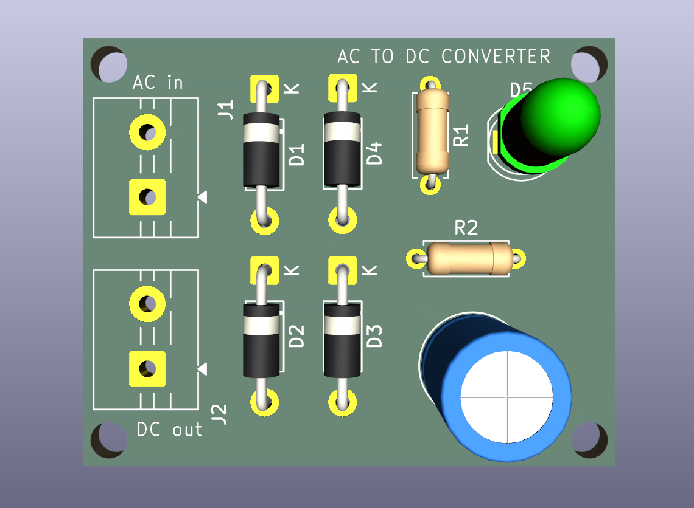
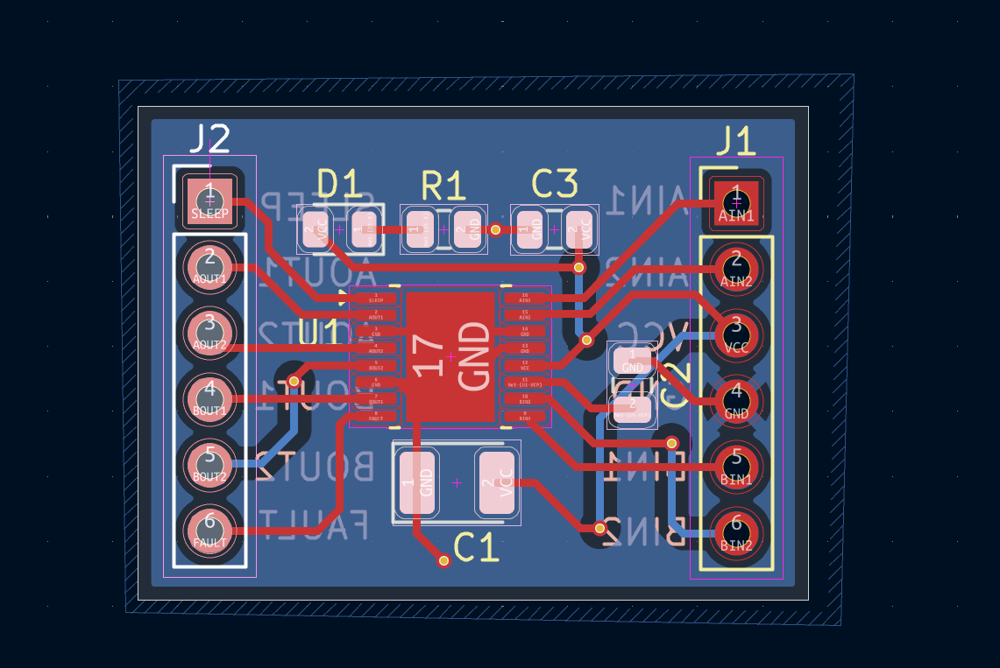
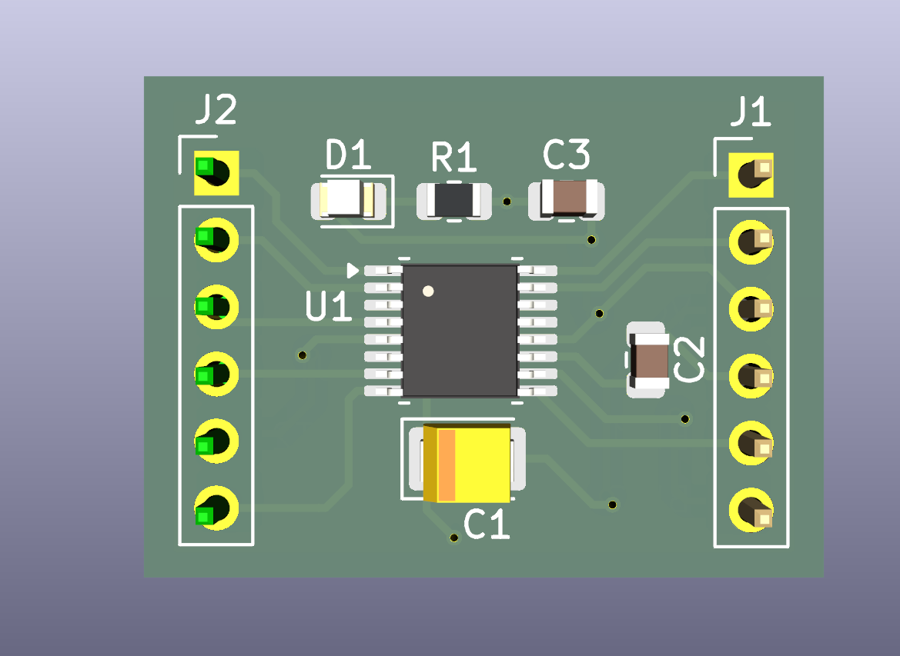

# KiCad Learning Projects

Welcome to my **KiCad Learning Projects** repository!

This repository documents my journey of learning **PCB design** using KiCad through a series of practical hardware projects. Each project has helped me build a stronger understanding of schematic design, PCB layout, component placement, routing, and hardware documentation.

---

## Skills Developed

* Schematic Capture
* PCB Layout & Routing
* Component & Footprint Selection
* Electrical Rule Check (ERC)
* Design Rule Check (DRC)
* Power & Signal Routing
* PCB Visualization
* Embedded Hardware Design
* GitHub

---

# Projects

## 01 - 12V AC to DC Converter

Designed a PCB for converting AC voltage to a regulated DC output while learning the complete PCB design workflow in KiCad.

<table>
<tr>
<td align="center">
 
<b>PCB Layout</b>
</td>

<td align="center">
 
<b>3D Front View</b>
</td>
</tr>
</table>

---

## 02 - Motor Driver

Designed a motor driver PCB to practice component placement, power routing, and PCB organization for embedded applications.

<table>
<tr>
<td align="center">
 
<b>PCB Layout</b>
</td>

<td align="center">
 
<b>3D Front View</b>
</td>
</tr>
</table>

---

## 03 - STM32 GPS Tracker with SIM808

Designed an STM32-based GPS tracking PCB integrating the SIM808 GSM/GPRS and GPS module.

<table>
<tr>
<td align="center">
 
<b>PCB Front Layout</b>
</td>

<td align="center">
 
<b>3D Front View</b>
</td>
</tr>
</table>

---

## 04 - STM32 Bluetooth 

Designed a custom STM32 Bluetooth development board to gain experience with wireless embedded hardware design. This project focused on Bluetooth module integration, PCB placement, routing, and overall board organization.

<table>
<tr>
<td align="center">
 
<b>PCB Layout</b>
</td>

<td align="center">
 
<b>3D Front View</b>
</td>
</tr>
</table>

---

## 05 - ESP32 S3 IOT Testboard

Designed a four-layer ESP32-S3 IoT development board featuring sensor interfaces and a QWIIC connector. This project provided practical experience with multilayer PCB design, power distribution, and high-density routing techniques.

<table>
<tr>
<td align="center">
 
<b>PCB Front Layout</b>
</td>

<td align="center">
 
<b>3D Front View</b>
</td>
</tr>
</table>

# Learning Goal

The purpose of this repository is to document my progress in PCB design while building a strong foundation in embedded systems and hardware engineering.

My long-term goal is to design complete embedded and robotics systems by combining PCB design, embedded software, CAD, and robotics.

# Acknowledgements

The projects in this repository were completed as part of my PCB design learning journey using the following educational resources:

Ampnics – Master KiCad With Projects (Projects 01–03)

Phil's Lab – KiCad 7 STM32 Bluetooth Hardware Design (Project 04)

KiCad 9: Design an ESP32-S3 IoT 4-layer PCB with Sensor and QWIIC Interface – Complete Guide (Project 05)

